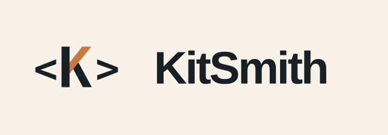

<h1 align="center">kitsmith</h1>

<p align="center">
  
</p>

An opinionated Bun-first project generator for people who code with AI agents and want stronger guardrails from the first commit.

It will not eliminate AI slop. No scaffold can. What it can do is catch obvious bugs earlier, enforce a shared set of conventions, and give agents a project shape that is harder to damage by accident.

## Why this exists

This project started from a recurring frustration: too much time was going into correcting the same classes of agent mistakes across different repositories.

At first, the fix was manual. Add the tools. Add the hooks. Tighten the lint rules. Bump OXLint, Biome, or another checker when a new family of mistakes kept showing up. Repeat the same setup in the next repo. Fix the same category of issues again.

Eventually the pattern became clear: the problem should be handled closer to the source.

The result is a reusable project foundation: centralized, shareable, and intentionally opinionated, while still being something you can tweak per project later.

## What it gives you

- A Bun/TypeScript project baseline with conventions already in place
- Guardrails for common mistakes before they become review work
- A repeatable setup for repos that will be touched by humans and AI agents
- Tooling and hooks that keep the project honest during day-to-day changes
- A way to apply the same baseline to an existing project instead of rebuilding it manually

## Who it is for

It is useful if you:

- build Bun projects with AI coding agents
- want to start vibe coding with more guardrails
- keep seeing agents produce the same avoidable mistakes
- want conventions enforced by tools instead of remembered by humans
- need a shared baseline across several repositories

## What it is not

This is not a guarantee of good code. It will not replace judgment, review, tests, or product thinking.

It is a starting point that makes the easy mistakes harder, keeps conventions visible, and reduces the amount of cleanup needed before real work can begin.

## Installation

Run without installing globally:

```bash
bunx kitsmith@0.3.0 --help
```

Bun is required. Install it from the [official Bun website](https://bun.com/) if it is not already available. The published CLI uses a Bun shebang and is not a Node-only executable.

Note: `npx kitsmith` works only if Bun is installed and available in `PATH`.

## Start a new project

```bash
bunx kitsmith@0.3.0 my-app --yes
```

## Adopt an existing project

Apply the `kitsmith` baseline to an existing Bun/TypeScript project.

```bash
bunx kitsmith@0.3.0 adopt . --apply --yes
```

Adoption copies OXLint rules as warnings by default in `--yes` mode, so an existing
codebase is not immediately blocked by a strict new lint gate. Use
`--lint-severity error` to adopt the same strict rule severities as new projects.

Adoption also installs the same Conventional Commits `commit-msg` hook as new
projects. Existing commit history is not rewritten, but future commits are checked.

Preview adoption changes without writing:

```bash
bunx kitsmith@0.3.0 adopt .
```

## CLI Options

```text
kitsmith [destination]
  --name <projectName>
  --backend <true|false>
  --frontend <none|tanstack>
  --ai <true|false>
  --effect <true|false>
  --install <true|false>
  --git-init <true|false>
  --yes

kitsmith adopt [destination]
  --name <projectName>
  --frontend <none|tanstack>
  --ai <true|false>
  --effect <true|false>
  --install <true|false>
  --lint-severity <warn|error>
  --apply
  --rollback <runId>
  --yes
```

## Scope

- Bun/TypeScript backend baseline
- Optional TanStack Router frontend preset
- Optional Effect starter
- Optional Claude/Codex agent guardrails
- Repo validation, formatting, linting, and safety hooks

## Maintainer workflow

Daily, deep, generated-project, sandbox, and release lanes are documented in
[docs/maintainer-validation.md](./docs/maintainer-validation.md). Kitsmith release
maintenance is documented in [docs/maintainer-release.md](./docs/maintainer-release.md).
Cocogitto is used only as maintainer release tooling; generated projects do not
receive Cocogitto.

## In short

A starting point for people who want to code faster with AI without accepting the default mess that often comes with it.

## License

MIT
